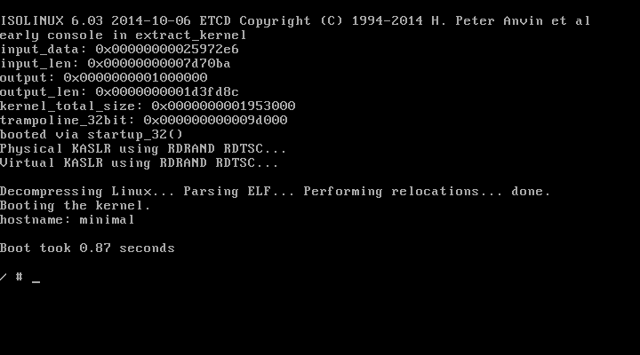

# Minimal Container Linux (MCL)

> Naming is hard. This is as good a project name as it gets :)
> Suggestions welcome!

This is a fork of (*not backwards portable*) of [minimal-linux-script](https://github.com/ivandavidov/minimal-linux-script)
which adds the following features:

## Features

* Docker based build environment (*CI friendly, ~20m build time*)
* Busybox user tools
* Dropbear ssh server
* Docker CE container runtime
* Full Networking support including DHCP
* Ships in a ~50MB ISO
* Boots in ~1s

**WARNING:**

> This is still highly experimental and only recently developed.
> Use at your own risk. Your mileage may vary.
> Absolutely no warranty or support.

## Requirements

* 192MB of Memory to boot
* Uses ~64MB at idle
* VirtualBox, QEMU, Proxmox, OpenStack, Cloud Provider or:

*Hardware support coming soon...*

## Contributing

Contributors welcome! Please file an issue or PR if you find bugs or improvements. Please help us test as well! Feedback is much appreciated.

## License

This project is licensed under the terms of the MIT license.
(*Original license  GPLv3 from fork of [minimal-linux-script](https://github.com/ivandavidov/minimal-linux-script)*)
